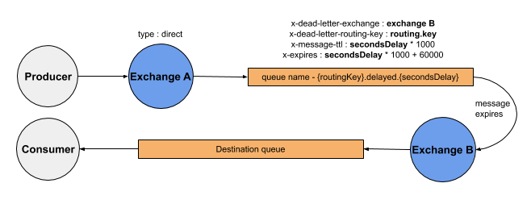

# Message production

### Basics

`IQueueService` represents a service that handles all the work of sending and receiving messages. You can inject `IQueueService` wherever you want in order to use it.

It can be a custom service or a controller.

```c#
[Route("api/[controller]")]
public class HomeController : Controller
{
    private readonly IQueueService _queueService;
    public HomeController(IQueueService queueService)
    {
        _queueService = queueService;
    }
}
```

Or you can get the instance of `IQueueService` in a console application.

```c#
public static class Program
{
    public static IConfiguration Configuration { get; set; }

    public static void Main()
    {
        var builder = new ConfigurationBuilder()
            .SetBasePath(Directory.GetCurrentDirectory())
            .AddJsonFile("appsettings.json", optional: false, reloadOnChange: true);
        Configuration = builder.Build();

        var serviceCollection = new ServiceCollection()
            .AddRabbitMqClient(Configuration.GetSection("RabbitMq"))
            .AddConsumptionExchange("exchange.name", Configuration.GetSection("RabbitMqExchange");

        var serviceProvider = serviceCollection.BuildServiceProvider();
        var queueService = serviceProvider.GetRequiredService<IQueueService>();
        // And you can use the IQueueService as you want.
    }
}
```

To publish a message to an exchange, use one of `IQueueService` sending methods.

You can send objects using `Send` or `SendAsync` methods. Objects will be serialized into json and sent with `IBasicProperties` where content type set as `"application/json"` and `Persistent` set as `true`.

```c#
var message = new
{
	Id = 1,
	Name = "RandomName"
};
queueService.Send(message, exchangeName: "exchange.name", routingKey: "routing.key");
// Or asyncronous version
await queueService.SendAsync(message, exchangeName: "exchange.name", routingKey: "routing.key");
```

With `SendJson` methods you can also send raw json in case you serialized it by yourself.

```c#
var message = "{\"id\": 1, \"name\": \"Bob\"}";
queueService.SendJson(message, exchangeName: "exchange.name", routingKey: "routing.key");
// Or asyncronous version
await queueService.SendJsonAsync(message, exchangeName: "exchange.name", routingKey: "routing.key");
```

If you want to send a message in another format different from json you can use `SendString` methods.
In this case `IBasicProperties` will be only with the `Persistent` property set as `true`, so you can send any string you want (e.g. an XML string).

```c#
var message = "<?xml version="1.0" encoding="UTF-8"?><message>Hello World!</message>";
queueService.SendString(message, exchangeName: "exchange.name", routingKey: "routing.key");
// Or asyncronous version
await queueService.SendStringAsync(message, exchangeName: "exchange.name", routingKey: "routing.key");
```

And if you want to manage everything by yourself you can use `Send` methods passing message as a byte array and `IBasicProperties` as parameters.

```c#
var properties = queueService.Channel.CreateBasicProperties();
// Set everything you want.
properties.Persistent = true;

var bytes = new byte[] { 72, 101, 108, 108, 111, 32, 119, 111, 114, 108, 100, 33 };
queueService.Send(bytes, properties, exchangeName: "exchange.name", routingKey: "routing.key");
// Or asyncronous version
await queueService.SendAsync(bytes, properties, exchangeName: "exchange.name", routingKey: "routing.key");
```

You are also allowed to send messages with delay (in seconds). All of previously listed methods have an overload that takes a `delay` parameter.

```c#
// Objects
queueService.Send(message, exchangeName: "exchange.name", routingKey: "routing.key", secondsDelay: 10);
await queueService.SendAsync(message, exchangeName: "exchange.name", routingKey: "routing.key", secondsDelay: 10);

// Json
queueService.SendJson(message, exchangeName: "exchange.name", routingKey: "routing.key", secondsDelay: 10);
await queueService.SendJsonAsync(message, exchangeName: "exchange.name", routingKey: "routing.key", secondsDelay: 10);

// Strings
queueService.SendString(message, exchangeName: "exchange.name", routingKey: "routing.key", secondsDelay: 10);
await queueService.SendStringAsync(message, exchangeName: "exchange.name", routingKey: "routing.key", secondsDelay: 10);

// Bytes
queueService.Send(bytes, properties, exchangeName: "exchange.name", routingKey: "routing.key", secondsDelay: 10);
await queueService.SendAsync(bytes, properties, exchangeName: "exchange.name", routingKey: "routing.key", secondsDelay: 10);
```

### Mechanism of sending delayed messages

The implementation of sending deferred (delayed) messages in this project is quite tricky.
The image below shows a model of the whole process of passing the message from the producer to the consumer.


**Prerequisites.** Let's say that producer want to send a message to the exchange **"Exchange B"** with a routing key **"routing.key"**, and a delay in **30 seconds**.
 - Message goes to the exchange **"Exchange A"** whose responsibility is to manage delaying (storing) the message.
 - After that a queue with a compound name and special arguments is being created. Name consists of three parts: the routing key of the sent message, a word "delayed", and a number of delay seconds .
Queue arguments are as follows.
```
x-dead-letter-exchange : Exchange В
x-dead-letter-routing-key : routing.key
x-message-ttl : secondsDelay * 1000
x-expires : secondsDelay * 1000 + 60000
```
 - A message, which gets in that queue, will have a specified ttl (time to live), and an exchange to which the message will be sent after expiration.
 - That new queue bounds to the **Exchange A**. That queue will be automatically deleted if there are no more messages in it within a minute.
 - Message goes to that queue, waits until an expiration moment and goes in the **"Exchange B"**, which routes it as it should be.
 - Message gets in the destination queue, and the consumer can retrieve that message.

For the exchange configuration see the [Previous page](exchange-configuration.md)

For message consumption features see the [Next page](message-consumption.md)